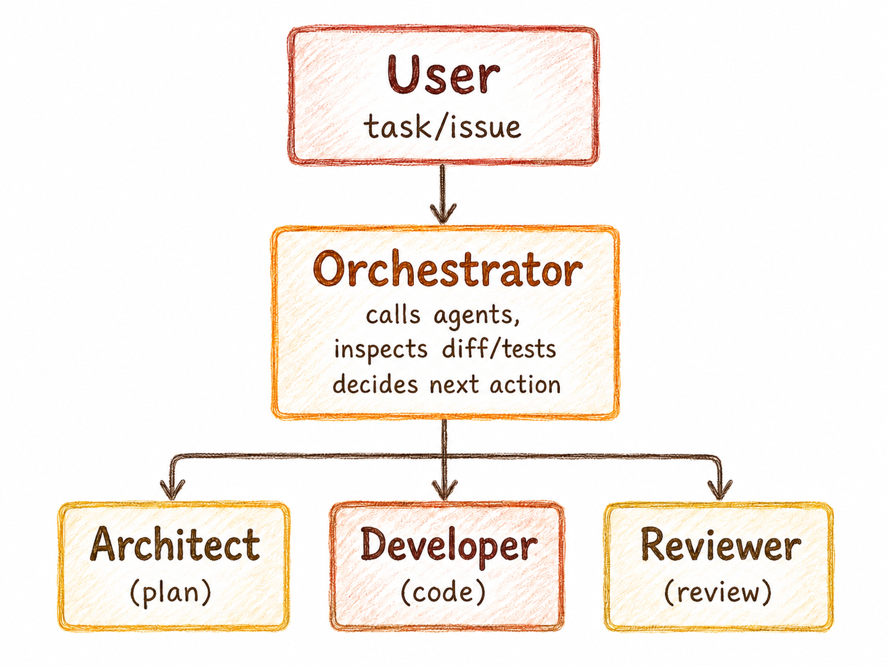

# Sub-Agent Orchestrator for Codex and OpenCode

This orchestrator turns an AI coding agent into a coding team: an **architect** plans the work, a **developer** implements one task at a time, and a **reviewer** checks the diff before anything gets approved. The orchestrator loops through *code → review → fix* cycles until the result is solid.

The point is simple: stop asking one giant agent to plan, code, and review inside the same overloaded context. Split the work. Keep the state on disk. Do not trust summaries when you can inspect the actual files.

**See [Installation guide](#installation) and read [Quick Start guide](#quick-start) before using it for best experience.**

## How it works

<p align="center">
    
</p>

### Three roles

Orchestrator spawns these subagents

| Role | Responsibility | Model preference |
|---|---|---|
| architect | Reads the repo and writes `spec.md`, `plan.md`, `spec.md` and task prompts. It does not edit code. | Strong reasoning model, for example `gpt-5.5 hith` |
| developer | Implements one task or one fix round. Uses TDD where it makes sense. | Small, fast coding model, for example `gpt-5.4-mini` |
| reviewer | Reviews the actual diff, tests, security boundaries, and spec compliance. It does not edit code. | Strong model, for example `gpt-5.5 medium` |

### Durable state on disk

Every session gets a timestamped folder:

```text
.agent/20260512T120000Z/
  issue.md          # Restated user request
  spec.md           # Desired behavior, constraints, acceptance criteria
  plan.md           # Ordered task IDs and dependencies
  status.md         # Live session state
  tasks/
    T001.md
    T002.md
    T001.round-2.fix.md
  reviews/
    T001.round-1.review.md
  logs/
    architect.round-1.result.md
    T001.round-1.diff
    T001.round-1.tests.log
    T001.round-1.developer.result.md
```

Because the state lives in files, you can pause a session, resume it later, read the history in any editor, and use `git diff` to see what changed.

### Rules the orchestrator enforces

- Only one implementation task can be active at a time.
- The developer must not implement later tasks early.
- The orchestrator checks the real diff and test results before approving work.
- After three failed fix rounds, it stops and asks for human input.
- Security issues or unclear requirements stop the run.

---

## Installation

### Option A: Global install

Make sure your agents exist. The install script creates these files:
   - Codex: `~/.codex/agents/architect.toml`, `developer.toml`, `reviewer.toml`
   - OpenCode: `~/.config/opencode/agents/architect.md`, `developer.md`, `reviewer.md`

> When installing globally don't forget to set up LLMs and reasoning level for subagents in their config files (`~/.codex/agents/*` and `~/.config/opencode/agents/*`)

---

#### Install the agents and skills globally so they are available in every project:

```bash
wget -qO- https://raw.githubusercontent.com/Glaicer/skill-subagent-orchestrator/main/install.sh | bash
```

#### Install only for Codex:

```bash
wget -qO- https://raw.githubusercontent.com/Glaicer/skill-subagent-orchestrator/main/install.sh | bash -s -- -codex
```

#### Install only for OpenCode:

```bash
wget -qO- https://raw.githubusercontent.com/Glaicer/skill-subagent-orchestrator/main/install.sh | bash -s -- -opencode
```
---

The installer downloads the `architect`, `developer`, and `reviewer` agent definitions into `~/.codex/agents/` or `~/.config/opencode/agents/`. It also downloads the orchestrator skill, prompt templates, and reference docs into the matching skills folder.

### Option B: Project-local install

Use a project-local install when you want to pin a release or keep everything inside the repository:

1. Download the latest release archive from [Releases](../../releases).
2. Copy contents of the `codex/` or `opencode/` folder into your project root `.codex` or `.opencode` folders respectively.
3. Set up **models** and **reasoning effort** in subagent config file (`/agents`)
4. Open the repo in Codex or OpenCode. The CLI should pick up the local agents and skills automatically.

## Quick start

1. Open your project in Codex or OpenCode.

2. Ask the orchestrator to do something substantial, for example:

   > "Add rate-limiting middleware with Redis fallback and unit tests. Use subagent orchestrator."

3. The orchestrator will:
   - Run preflight checks such as `git status` and agent detection.
   - Ask the architect to write the spec and plan.
   - Run each task through the developer and reviewer loop.
   - Run a final review after all tasks are approved.

4. Check `.agent/` anytime to see the full trail.

## Repository layout

```
.
├── codex/
│   ├── agents/
│   │   ├── architect.toml
│   │   ├── developer.toml
│   │   └── reviewer.toml
│   └── skills/
│       └── codex-orchestrator-subagents/
│           ├── SKILL.md
│           ├── assets/
│           │   ├── task-prompt-template.md
│           │   └── fix-prompt-template.md
│           ├── references/
│           │   ├── codex-subagents.md
│           │   └── review-contract.md
│           └── scripts/
│               └── init-session.sh
├── opencode/
│   ├── agents/
│   │   ├── architect.md
│   │   ├── developer.md
│   │   └── reviewer.md
│   └── skills/
│       └── opencode-orchestrator-subagents/
│           ├── SKILL.md
│           ├── assets/
│           │   ├── task-prompt-template.md
│           │   └── fix-prompt-template.md
│           ├── references/
│           │   ├── opencode-subagents.md
│           │   └── review-contract.md
│           └── scripts/
│               └── init-session.sh
├── install.sh
├── build-release.sh
└── README.md
```

- `install.sh` installs the agents and skills globally through `wget | bash`.
- `build-release.sh` packs `codex/` and `opencode/` into a versioned tarball.
- `SKILL.md` contains the orchestration protocol for each platform.

## Requirements

- Codex with custom agent support, or OpenCode with subagent and skills support.
- A `git` repository. The orchestrator relies on `git diff` and `git status` for validation.
- Recommended: `agents.max_depth = 1` for Codex, or the equivalent setting for OpenCode, so subagents do not recursively spawn more subagents.

## License

MIT
